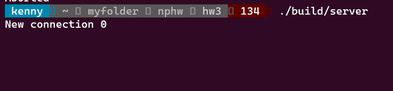
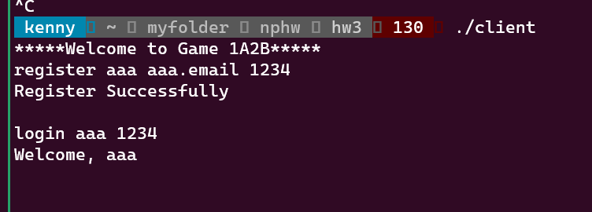

## 1a2b game
- a small command line game, implemented by c++ and socket

## usage
- make
- server: ./build/server
- client: ./client
- server and client should run in different shell
- can accept multiple client(up to 10)
- command: https://docs.google.com/document/d/12Qz1lLTA35ZONb_nOqrUcajaTYpKy-b73bk-n2_mSCM/edit

## snapshot

